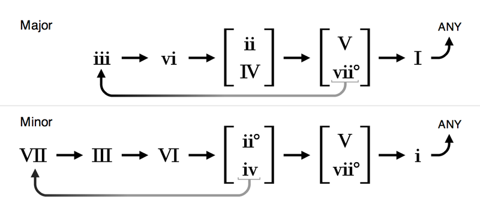

# musgen
An algorithmic approach to music generation using the rules of harmonic motion

## Installation

Requires Python 2.7 and [mingus](https://github.com/bspaans/python-mingus/)

### Setup
1) `virtualenv venv`
2) `source venv/bin/activate`
3) `pip install mingus`
4) Run with `python src/musgen.py`. 

You should now see two new new MIDI files at `src/` - a comp track and a melody track. Drop these into a DAW and give them a listen.

### Available Parameters

```
progressionLength = 12 // Number of chords
key = Key.G // Key of progression
meter = (4,4) // The measure meter
scale = Scale.Major // Major or Minor
firstScalechord = Chord.I // The first scale degree
```

### Rules of Harmonic Motion



## TODO
* Command-line arguments for parameters and output directory
* Output audio files in addition to MIDI
* Ouput sheet music
* More harmonic variety
* More rhythmic variety
